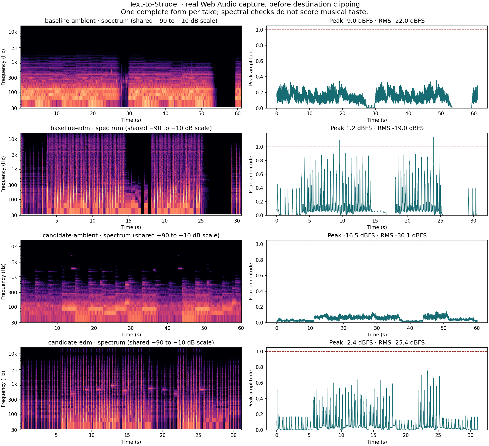

# Decoded generative music: quality evidence

Measured on 2026-09-14 with the pinned `@strudel/repl@1.3.0` runtime. The decoder turns arbitrary Unicode input into 16 structural cells: pitch contour, attack, rest boundaries, and repetition. Those cells directly shape motifs, rhythm, density, and form; the full normalized input also seeds independent variation streams. This is a designed musical interpretation, not semantic decryption.

Randomness operates inside musical constraints: shared chord voicings, compact chord-tone motifs, returning statements and cadences, complementary lead/answer gates, rooted bass, genre-specific drum anchors, and bounded section dynamics. Same input, genre, and take state remain reproducible. Melody, groove, and arrangement controls preserve the other dimensions and manual edits.

## Variation coverage

Each dimension was varied 64 times independently for three inputs: `q7X-2049 / 🪐 / 바람... 314159`, `0123456789`, and `loop loop loop / 東京의 비`. Values are the **minimum distinct outputs across those inputs**, not a musical preference score. Melody compares note/rest patterns; groove compares drum patterns; arrangement compares role masks and sound choices; harmony compares chord symbols. Comments and labels are excluded.

| Genre | Melody, before → after | Groove, before → after | Arrangement, before → after | Harmony, before → after |
|---|---:|---:|---:|---:|
| EDM | 5 → 64 | 4 → 64 | 6 → 63 | 28 → 54 |
| Jazz | 5 → 64 | 3 → 64 | 8 → 63 | 21 → 59 |
| Classical | 5 → 64 | — | 4 → 64 | 21 → 36 |
| Blues | 5 → 64 | 3 → 64 | 6 → 64 | 12 → 64 |
| Ambient | 5 → 59 | — | 4 → 64 | 18 → 51 |
| Lo-fi | 5 → 64 | 3 → 64 | 6 → 64 | 18 → 62 |
| World | 5 → 64 | 3 → 64 | 2 → 55 | 12 → 31 |
| Random | 5 → 64 | 3 → 64 | 6 → 63 | 26 → 61 |
| Jazz + EDM | 5 → 64 | 3 → 64 | 2 → 58 | 21 → 63 |

Classical and Ambient intentionally have no drum layer. [Raw diversity measurements](diversity.json).

“Before” is the local engine snapshot **after** the initial melody-onset, drum-stacking, voicing, and shared-swing fixes but **before** the structural decoder and procedural variation changes. It is not the previous production `main`. Snapshot SHA-256: `023ae144c405db5ce78f14c27d5a1c9315b390d39b84c87d6da0ceea19cc1b85`. The snapshot itself is not bundled; the four captured scores below preserve the audio comparison, and the scripts reproduce current candidate measurements.

## Real audio and spectrograms

The browser played one complete form plus two seconds for the first corpus input at take zero, in EDM and Ambient. A development-only Web Audio tap captured float stereo PCM **before destination clipping**, after warming the sample cache. The app contains no recording instrumentation. All four captures were finite and non-silent, with no runtime console errors.

| Capture | Duration | Peak dBFS | RMS dBFS | Samples above full scale |
|---|---:|---:|---:|---:|
| Baseline Ambient | 61.11 s | −8.98 | −22.01 | 0 |
| Candidate Ambient | 60.19 s | −16.50 | −30.09 | 0 |
| Baseline EDM | 30.65 s | +1.16 | −19.01 | 12 |
| Candidate EDM | 31.11 s | −2.45 | −25.40 | 0 |

The candidate reserves more headroom and keeps a quiet harmonic thread through section breaks. The spectrogram shows continued pitched energy through those breaks and distinct drum transients. These captures are **not loudness matched**: lower peak/RMS levels alone do not establish a musical preference, and two takes do not guarantee every possible mix is free of clipping. Use the [listening checklist](../musicality-checklist.md) for subjective, volume-matched assessment; no human listening scores are claimed here.



[Level measurements](spectrogram.json) · Scores: [baseline EDM](baseline-edm.strudel), [candidate EDM](candidate-edm.strudel), [baseline Ambient](baseline-ambient.strudel), [candidate Ambient](candidate-ambient.strudel).

## Reproduce and validate

```bash
npm test
npm run typecheck
npm run e2e
npm run qa:music -- --out /tmp/music-diversity.json

# Run this server in a separate terminal for audio capture:
python3 -m http.server 4173 --bind 127.0.0.1
# Then capture both candidate genres:
npm run qa:record -- --out /tmp/music-audio
# Plotting requires Python numpy, scipy, and matplotlib:
python3 scripts/spectrogram.py /tmp/music-audio --out /tmp/music-spectrogram.png
```

Both QA scripts accept `--baseline /path/to/app.js` to compare a compatible engine snapshot. Audio capture also accepts `--url`. Timing and sample playback can cause small audio-measurement differences across runs; note generation itself is deterministic.

Unit tests cover causal input mapping with an identical random stream, Unicode/long-input bounds, reproducibility, variation diversity, phrase duration, and focused-edit preservation. Browser tests evaluate actual Strudel events across all seven genres, Random, and Fusion: finite pitches, intended attacks, drum multiplicity, complementary phrase gates, and sounding harmony. UI tests cover both themes, provider failures, sandbox boundaries, controls, and mobile layouts.
